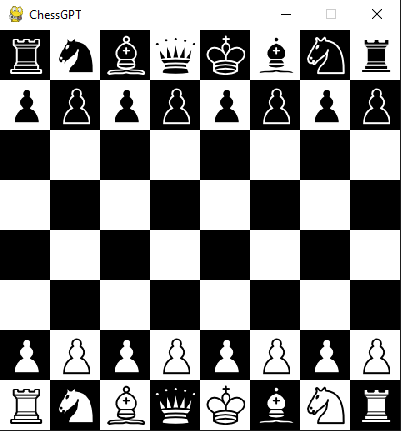
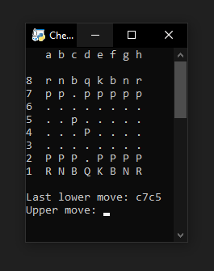

# ChessGPT
Play chess against GPT, it works using the OPEN AI api.

## Install dependencies

```sh
pip3 install -r requeriments.txt
```

## Setup

Create an ".env" file and put your OPEN AI api key and the model you want to use.
if you use GPT-4 you will have a better opponent, but by default it is set to GPT-3.5 Turbo model.

## Run

Pygame version:
```sh
python pygame_ver.py
```


or

ASCII version:
```sh
python ascii_ver.py
```
